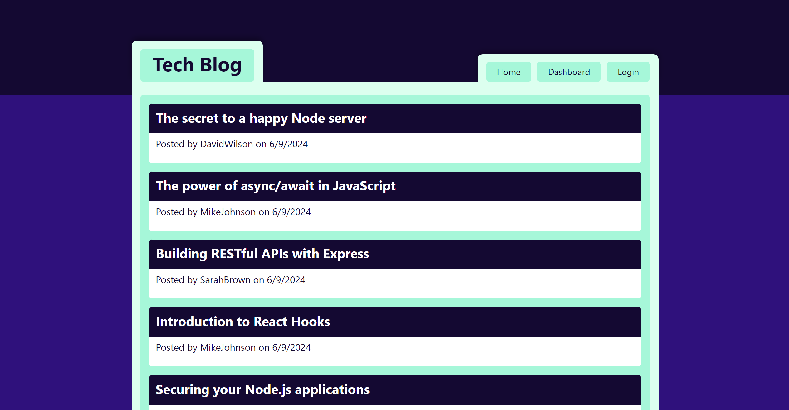
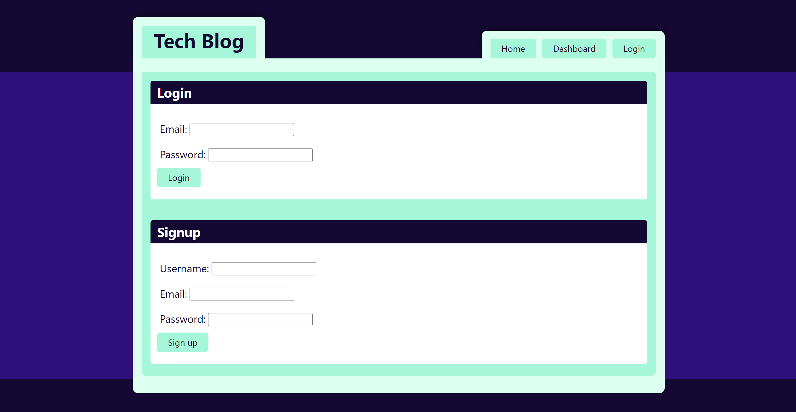

# tech-blog

## Project Description

A study in creating a CMS-style blog that follows MVC structure, using Handlebars.js template engine, Sequelize as the ORM, and authenticates with the express-session npm package.

## Contents

- [Introduction](#introduction)
- [Problem](#problem)
- [Solution](#solution)
- [Deployment](#deployment)
- [Collaborators](#collaborators)
- [Resources](#resources)
- [License](#License)

## Introduction

For this project, I was tasked with creating a tech-focused blog posting application from scratch, intended for sharing your thoughts and commenting on other developers' thoughts.

## Problem

I was given the following requirements by the client for this project:

- GIVEN a CMS-style blog site
- WHEN I visit the site for the first time
- THEN I am presented with the homepage, which includes existing blog posts if any have been posted; navigation links for the homepage and the dashboard; and the option to log in
- WHEN I click on the homepage option
- THEN I am taken to the homepage
- WHEN I click on any other links in the navigation
- THEN I am prompted to either sign up or sign in
- WHEN I choose to sign up
- THEN I am prompted to create a username and password
- WHEN I click on the sign-up button
- THEN my user credentials are saved and I am logged into the site
- WHEN I revisit the site at a later time and choose to sign in
- THEN I am prompted to enter my username and password
- WHEN I am signed in to the site
- THEN I see navigation links for the homepage, the dashboard, and the option to log out
- WHEN I click on the homepage option in the navigation
- THEN I am taken to the homepage and presented with existing blog posts that include the post title and the date created
- WHEN I click on an existing blog post
- THEN I am presented with the post title, contents, post creator’s username, and date created for that post and have the option to leave a comment
- WHEN I enter a comment and click on the submit button while signed in
- THEN the comment is saved and the post is updated to display the comment, the comment creator’s username, and the date created
- WHEN I click on the dashboard option in the navigation
- THEN I am taken to the dashboard and presented with any blog posts I have already created and the option to add a new blog post
- WHEN I click on the button to add a new blog post
- THEN I am prompted to enter both a title and contents for my blog post
- WHEN I click on the button to create a new blog post
- THEN the title and contents of my post are saved and I am taken back to an updated dashboard with my new blog post
- WHEN I click on one of my existing posts in the dashboard
- THEN I am able to delete or update my post and taken back to an updated dashboard
- WHEN I click on the logout option in the navigation
- THEN I am signed out of the site
- WHEN I am idle on the site for more than a set time
- THEN I am able to view posts and comments but I am prompted to log in again before I can add, update, or delete posts

## Solution

I addressed the above problems in the following way:

- I configured the Express server & Sequelize architecture after installing the following NPM packages: bcrypt, dotenv, express, express-handlebars, express-session, connect-session-sequelize, sequelize, and mysql2.
- I developed the sequelize models and seed data to match.
- I designed and built a modular UI using the Handlebars template engine, intended to be both polished and responsive.
- I utilized bcrypt and an auth util file to enable secure user logins and data handling.

See below for screenshots of the home and login pages:

## Deployment

[Link to the GitHub repo for this project](https://github.com/Aoliva96/tech-blog)

[Link to the deployed project on Heroku](https://bootcamp-project-tech-blog-6939c1dede08.herokuapp.com/)

## Collaborators

I collaborated with my classmate George Schultz on this project to address issues with the server and database interactions.

## Resources

See the links below to see some of the resources I used for this project:

[Home | HandlebarsJS](https://handlebarsjs.com/)

[node.bcrypt.js | NPM](https://www.npmjs.com/package/bcrypt)

[Sequelize v6 | Sequelize](https://sequelize.org/docs/v6/)

I also referenced the week 14 bootcamp mini-project solution for the project file structure, and utilized a modified version of its jass.css file for project styles.

## License

This project utilizes the standard MIT License.
